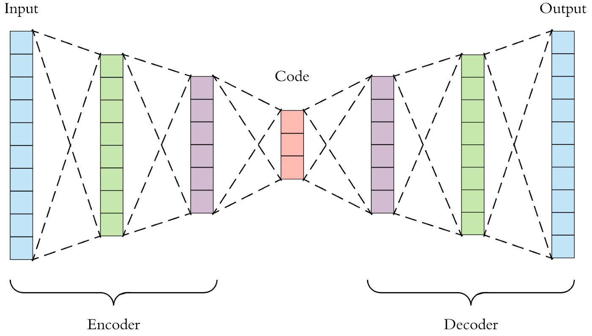

# Autoencoder

## Introduction

- Autoencoders are a specific type of feedforward neural networks where the input is the same as the output. They compress the input into a lower-dimensional compressed representation (space) and then reconstruct the output from this representation. The code is a compact “summary” or “compression” of the input, also called the latent-space representation.


---

- An autoencoder consists of 3 components: encoder, code (latent space) and decoder. The encoder compresses the input and produces the code, the decoder then reconstructs the input only using this code.


- To build an autoencoder we need 3 things: an encoding method, decoding method, and a loss function to compare the output with the target. We will explore these in the next slide

##

Autoencoders are mainly a dimensionality reduction (or compression) algorithm with a couple of important properties:

- Data-specific: Autoencoders are only able to meaningfully compress data similar to what they have been trained on. Since they learn features specific for the given training data, they are different from a standard data compression algorithm like gzip. So we can’t expect an autoencoder trained on handwritten digits to compress landscape photos.

##

- Lossy: The output of the autoencoder will not be exactly the same as the input, it will be a close but degraded representation.

- Unsupervised:  Autoencoders are considered an unsupervised learning technique since they don’t need explicit labels to train on. But to be more precise they are self-supervised because they generate their own labels from the training data.

# Architecture of the Autoencoder

## 

- Let’s explore the details of the encoder, code, and decoder. Both the encoder and decoder are fully-connected feedforward neural networks. Code (also known as the latent space layer) is a single layer of an ANN with the dimensionality of our choice. The number of nodes (neurons) in the code layer (code size) is a hyperparameter that we set before training the autoencoder.


##


## 

Let us look at the autoencoder structure in a more detailed visualization. First the input passes through the encoder, which is a fully-connected ANN, to produce the code. 



##

The decoder, which has the similar ANN structure, then produces the output only using the code. 


## 
The goal is to get an output identical with the input. The only requirement is the dimensionality of the input and output needs to be the same. Anything in the middle can be play with.


##

- We can use a linearly activated autoencoder (AE) to approximate principal component analysis (PCA). From a math point of view, minimizing the reconstruction error in PCA is the same as linear AE [3].

There are 4 hyperparameters that we need to set before training an autoencoder:

- Code size: number of nodes in the middle layer. Smaller size results in more compression.
- Number of layers: the autoencoder can be as deep as we like. In the figure above we have 2 layers in both the encoder and decoder.

##


- Number of nodes per layer: the autoencoder architecture presented is called a stacked autoencoder since the layers are stacked one after another. Usually stacked autoencoders look like a “sandwitch”. The number of nodes per layer decreases with each subsequent layer of the encoder, and increases back in the decoder. Also the decoder is symmetric to the encoder in terms of layer structure. This is not necessary and we have total control over these parameters.
- Loss function: we either use mean squared error (mse) or binary crossentropy. If the input values are in the range [0, 1] then we typically use crossentropy, otherwise we use the mean squared error.

## Example


<!-- ## -->
<!-- - In the simplest, the dissimilarity between two observations i and j, say, d1(i, j), is given by the proportion of trees in which those two observations land in different leaves. That is, the dissimilarity between observations associated with a particular tree t is d_t1 (i, j) = 0 or 1, depending on whether i and j do, or do not, fall into the same leaf under tree t. Then over a set of T trees, d1(i, j) = ∑t d t 1 (i, j)/T.  -->

<!-- - The other 3 distances can be explained later. -->


<!-- ## Advantages -->
<!-- The use of a tree-based clustering algorithm, has major advantages over standard clustering algorithms that use Euclidean distance metrics. In particular,  -->

<!-- - This method adapts well to the inclusion of both continuous and categorical variables in the clustering algorithm,  -->
<!-- - resistant to outliers.  -->
<!-- - unaffected by linear scaling. -->
<!-- - lessens the effect of collinearity among variables. -->


<!-- ##  -->
<!-- ```{r, gathering_data, cache=TRUE} -->
<!-- # Gathering the data -->
<!-- Airway2_presentation <- read.csv('/Users/xbasra/Documents/Data/Clustering/Results_Data_Reports/CsvData/Airway2.csv')  -->
<!-- Airway2_presentation <- Airway2_presentation[-c(1)] -->
<!-- ``` -->


<!-- ## -->

<!-- ```{r, message=FALSE} -->
<!-- library(treeClust) -->
<!-- library(factoextra) -->
<!-- library(Rtsne) -->
<!-- library(dplyr) -->
<!-- # important to set a seed here -->
<!-- set.seed(4) -->
<!-- airway.tc <- treeClust(Airway2_presentation, d.num = 4, control = treeClust.control(return.trees = TRUE, return.dists = TRUE)) -->
<!-- h_tree_presentation <- hcut(airway.tc$dists, 8, isdiss = TRUE, hc_method = 'ward.D2') -->
<!-- table(h_tree_presentation$cluster) -->
<!-- ``` -->

<!-- ## -->

<!-- ```{r} -->
<!-- set.seed(10) -->
<!-- # Tsne for tree distacne -->
<!-- tsne_tree_distance <- Rtsne(X = airway.tc$dists, is_distance = TRUE, check_duplicates = FALSE) -->

<!-- tsne_tree_distance <- tsne_tree_distance$Y %>% -->
<!--   data.frame() %>% -->
<!--   setNames(c("X", "Y")) -->
<!-- tsne_tree_distance$cl <- factor(h_tree_presentation$cluster) -->
<!-- ggplot(tsne_tree_distance, aes(x=X, y=Y, color=cl)) + geom_point() -->
<!-- ``` -->


# mutual information-based unsupervised feature transformation recall

## Motivation

- Traditional centroid-based clustering algorithms for heterogeneous data with
numerical and non-numerical features result in different levels of inaccurate clustering. 

- This is because the Hamming distance used for dissimilarity measurement of non-numerical
values does not provide optimal distances between different values-

- Another problems arise from attempts to combine the Euclidean distance and Hamming distance. 

##

- Introduce the mutual information (MI)-based unsupervised feature transformation (UFT), which can transform non-numerical features into numerical features without information loss.
- For the original non-numerical features, UFT can provide numerical values which preserve the structure of the original non-numerical features and have the property of continuous values at the same time.

##


# Deep Embedding Clustering 

##

* Deep clustering is a recent trend in the machine learning community that aims to employ a deep neural network in an unsupervised learning form. One of the main families of deep clustering is Deep Embedding Clustering (DEC) Xie, Girshick, and Farhadi (2016). The fundamental work of DEC is to learn latent space that preserves properties of the data.

- DEC has two phases:
 1. parameter initialization with a deep autoencoder (Vincent et al., 2010)
 2. parameter optimization (i.e., clustering), where we iterate between computing an auxiliary target distribution and minimizing the Kullback–Leibler (KL) divergence to it.


<!-- ## -->

<!-- <section> -->
<!-- 					<section  id="Steps"> -->
<!-- 						  <h2>Phase1</h2> -->
<!-- 						  <p class="fragment fade-in-then-semi-out"> 1 - Use UFT transformation to convert the categorical data type to Numerical type.</p> -->
<!-- 						  <p class="fragment">2 - Run Autoencoder Nueral network to get an initial low dismentional representation of our data (from 21 dimensions to 10 dimensions).</p> -->
<!-- 						  <p class="fragment"> 3 - Similar to the regression models the autoencoder has learned a parameters that can be used to calculate the low dimensinla latent space. Using these parameters we calculate the z_i (the points in the embedded space). </p> -->
<!--           </section> -->
<!--           <section> -->
<!-- 					  <section id="Phase2"> -->
<!-- 						  <p class="fragment fade-in-then-semi-out"><p class="fragment"> 4 - Run K-means algorithm on the latesnt space (the output of the Autoencoder) to determine the four centers of the clusters mu_i. </p> -->
<!-- 						  <p class="fragment">2 - Run Autoencoder Nueral network to get an initial low dismentional representation of our data (from 21 dimensions to 10 dimensions).</p> -->
<!-- 						  <p class="fragment"> 3 - Similar to the regression models the autoencoder has learned a parameters that can be used to calculate the low dimensinla latent space. Using these parameters we calculate the z_i (the points in the embedded space). </p> -->
<!--           </section> -->
<!-- </section> -->


## Phase 1 initialization:

  1. Use UFT transformation to convert the categorical data type to Numerical type.
  2. Run the Autoencoder Neural network to get an initial low dimensional representation of our data (from 21 to 10 dimensions).
  3. Similar to the regression models the autoencoder has learned parameters that can be used to calculate the low dimensional latent space. Using these parameters we calculate the $z_i$ (the points in the embedded space).
  4. Run the K-means algorithm on the latent space (the output of the Autoencoder) to determine the four centers of the clusters $\mu_i$. 

## Phase 2 (Repeat until convergence)

  5. Calculate the quantity $q_{ij}$. This represents student t-distribution as a kernel to measure the similarity (distance) between all the points $z_i$ and the four centers $\mu_i$. For instance, $q_{ij}=(0.5,0.2,0.2,0.1)$. $q_{ij}$ can be interpreted as the probability of assigning sample i to cluster j (soft cluster). Hence, we get the joint probability distribution $Q$.
  6. Calculate $p_{ij}$ the auxiliary targe distribution. It should look something like this $p_{ij} =(1,0,0,0)$. Hence, $P$.
  7. Calculate the KL-Divergence (Kullback-Leibler) $L = KL(P||Q = \sum_i \sum_j p_{ij} \log \frac{p_{ij}}{q_{ij}})$.
  8. Run an Optimization algorithm called ADAM (Adaptive Moment Estimation) a variant of the Stochastic Gradient Descent on a batch of samples.
  
##  
  9. Update our $\mu_i$, and the autoencoder parameters $\theta$. Updating the autoencoder parameters means that we are learning a feature representation for the latent space and the clustering simultaneously.
  10. Check pre-defined Convergence criteria on the difference between the label assignments. We define a threshold value for which we keep iterating until we threshold achieved (Convergence criteria).
  11. Repeat the steps from 5 to 10. If convergence is attained we stop training.
  12. Use the Clustering layer by employing the learned parameters and cluster centers.   
 

##

 


# Application to our data set

```{r loadlib, include=FALSE}
library(FactoMineR)
library(factoextra)
library(Rtsne)
library(tidyr)
library(plotly)
library(tidyverse)
```

##

```{r, message=FALSE}
# Get the data

#DEC_Embedding = read.csv('/Users/xbasra/Documents/Data/Clustering_Food_Alergies/Intermediate/CsvData_Output/DEC_Embedding.csv')

DEC_Embedding = read.csv('/home/rstudio/food_clustering/Intermediate/CsvData_Output/DEC_Embedding_5.csv')

# resultft_DEL_all <- read.csv('/Users/xbasra/Documents/Data/Clustering_Food_Alergies/Intermediate/CsvData_Output/resultft_DEL_all.csv')
resultft_DEL_all <- read.csv('/home/rstudio/food_clustering/Intermediate/CsvData_Output/resultft_DEL_all_5_cluster.csv')
# replacing the empty space "" values with no as done in the main analysis file
resultft_DEL_all$farmlive[resultft_DEL_all$farmlive == ""] <- NA
resultft_DEL_all <-  resultft_DEL_all %>% replace_na (list(farmlive = 'no'))
#tsne_converted_food$cl_DEL <- factor(resultft_DEL_all$cluster)
#ggplot(tsne_converted_food, aes(x=X, y=Y, color=cl_DEL)) + geom_point()
resultft_DEL_all$cluster <- as.factor(resultft_DEL_all$cluster)
```

```{r}
install.packages("plyr")
library(plyr)
resultft_DEL_all$cluster <-  plyr::revalue(resultft_DEL_all$cluster, c("0" = "cluster 1", "1" = "cluster 2", "2" = "cluster 3", "3" = "cluster 4", "4" = "cluster 5" ))
```
##
2D Tsne plot
```{r, cache=TRUE, message=FALSE, }
# Tsne plot 2D
set.seed(10)
#tsne_converted_food_DEL <- Rtsne(X = EDL_Embedding ,perplexity= 200, is_distance = FALSE, check_duplicates = FALSE)
tsne_converted_food_DEC <- Rtsne(X = DEC_Embedding ,perplexity= 150, is_distance = FALSE, check_duplicates = FALSE)

tsne_converted_food_DEC <- tsne_converted_food_DEC$Y %>%
  data.frame() %>%
  setNames(c("X", "Y"))

tsne_converted_food_DEC$clusters <- factor(resultft_DEL_all$cluster)
```

##


```{r, message=FALSE, echo=FALSE, cache=TRUE}
p1 <- ggplot(tsne_converted_food_DEC, aes(x=X, y=Y, color=clusters)) + geom_point() + theme_minimal()+ theme(axis.title=element_blank(),axis.ticks=element_blank()) 
p1
```


##

```{r, cache=TRUE, message=FALSE}
# 3D plot
tsne_converted_food_DEC_3d <- Rtsne(X = DEC_Embedding ,perplexity= 150, dims = 3, is_distance = FALSE, check_duplicates = FALSE)

tsne_converted_food_DEC_3d <- tsne_converted_food_DEC_3d$Y %>%
  data.frame() %>%
  setNames(c("X", "Y", "Z"))

tsne_converted_food_DEC_3d$cl <- factor(resultft_DEL_all$cluster)

```

## 
3D tsne plot

```{r, message=FALSE, echo=FALSE, cache=TRUE}
p2 <- plot_ly(tsne_converted_food_DEC_3d, x = ~X, y = ~Y, z = ~Z, color = ~cl, colors = c('#BF382A', '#0C4B8E')) %>%
  add_markers() %>%
  layout(scene = list(xaxis = list(title = 'Dim1'),
                     yaxis = list(title = 'Dim2'),
                     zaxis = list(title = 'Dim3')))
p2
```


<!-- ```{r load libraries, message=FALSE, warning=FALSE} -->
<!-- library(umap) -->
<!-- library(ggplot2) -->
<!-- # get the data -->
<!-- converted_UFT_presentation <- read.csv('/Users/xbasra/Documents/Data/Clustering/Results_Data_Reports/CsvData/converted_UFT_presentation.csv') -->
<!-- g_ever_smoke_old <- ggplot(converted_UFT_presentation, aes(x=id, y=ever_smoker20py_old, color=ever_smoker20py_old)) + geom_point() -->
<!-- g_ever_smoke_old -->
<!-- ``` -->

<!-- ```{r, message=FALSE, eval=FALSE, echo=FALSE} -->
<!-- #library(plotly) -->
<!-- # trying multiple plots did not work -->
<!-- ggarrange(g_ever_smoke, g_ever_smoke_old, ncol = 2, nrow = 1) -->
<!-- library(cowplot) -->
<!-- library(gridExtra) -->
<!-- #plot_grid(g_ever_smoke, g_ever_smoke_old, ncol = 2, nrow = 1) -->
<!-- #grid.arrange(g_ever_smoke, g_ever_smoke_old + rremove("x.text"), ncol = 2, nrow = 1) -->
<!-- ``` -->

<!-- ```{r ever_smoke, echo=FALSE, cache=TRUE} -->
<!-- g_ever_smoke <- ggplot(converted_UFT_presentation, aes(x=id, y=ever_smoker20py, color=ever_smoker20py_old)) + geom_point() -->
<!-- g_ever_smoke -->
<!-- ``` -->


<!-- ```{r ever_smoke_distribution, message=FALSE, echo=FALSE, cache=TRUE} -->
<!-- gg1 <- ggplot(converted_UFT_presentation, aes(ever_smoker20py)) + scale_fill_brewer(palette = "Spectral") -->

<!-- kk1 <- gg1 + geom_histogram(  -->
<!--                    binwidth = .1,  -->
<!--                    col="black",  -->
<!--                    size=.1) +  # change binwidth -->
<!--   labs(title="Histogram with Auto Binning for the ever_smoker20py",  -->
<!--        x="ever_smoker20py")   -->
<!-- kk1 -->
<!-- #ggplotly(kk1) -->
<!-- ``` -->

<!-- ## -->


<!-- ```{r exp_dust_work, echo=FALSE} -->
<!-- ggplot(converted_UFT_presentation, aes(x=id, y=exp_dust_work, color=exp_dust_work_old)) + geom_point() -->
<!-- ``` -->


<!-- ##  -->

<!-- ```{r exp_dust_work_distribution, echo=FALSE, cache=TRUE} -->
<!-- gg2 <- ggplot(converted_UFT_presentation, aes(exp_dust_work)) + scale_fill_brewer(palette = "Spectral") -->

<!-- kk2 <- gg2 + geom_histogram(  -->
<!--                    binwidth = .1,  -->
<!--                    col="black",  -->
<!--                    size=.1) +  # change binwidth -->
<!--   labs(title="Histogram with Auto Binning for the exp_dust_work",  -->
<!--        x="exp_dust_work")   -->
<!-- #ggplotly(kk2) -->
<!-- kk2 -->
<!-- ``` -->


<!-- ## -->

<!-- ```{r Sputum_production, echo=FALSE} -->
<!-- ggplot(converted_UFT_presentation, aes(x=id, y=Sputum_production, color=Sputum_production_old)) + geom_point() -->
<!-- ``` -->


<!-- ```{r Sputum_production_distribution, echo=FALSE} -->
<!-- gg3 <- ggplot(converted_UFT_presentation, aes(Sputum_production)) + scale_fill_brewer(palette = "Spectral") -->

<!-- kk3 <- gg3 + geom_histogram(  -->
<!--                    binwidth = .1,  -->
<!--                    col="black",  -->
<!--                    size=.1) +  # change binwidth -->
<!--   labs(title="Histogram with Auto Binning for the Sputum_production",  -->
<!--        x="Sputum_production")   -->
<!-- #ggplotly(kk3) -->
<!-- kk3 -->
<!-- ``` -->

<!-- ## -->

<!-- ```{r asthmatic_wheeze, echo=FALSE, cache=TRUE} -->
<!-- ggplot(converted_UFT_presentation, aes(x=id, y=asthmatic_wheeze, color=current_asthma_old)) + geom_point() -->
<!-- ``` -->


<!-- ```{r asthmatic_wheeze_distribution, echo=FALSE, cache=TRUE} -->
<!-- gg4 <- ggplot(converted_UFT_presentation, aes(asthmatic_wheeze)) + scale_fill_brewer(palette = "Spectral") -->

<!-- kk4 <- gg4 + geom_histogram(  -->
<!--                    binwidth = .1,  -->
<!--                    col="black",  -->
<!--                    size=.1) +  # change binwidth -->
<!--   labs(title="Histogram with Auto Binning for the asthmatic_wheeze",  -->
<!--        x="asthmatic_wheeze")   -->
<!-- #ggplotly(kk4) -->
<!-- kk4 -->
<!-- ``` -->


<!-- ```{r} -->
<!-- umap_UFT_presentation <- read.csv('/Users/xbasra/Documents/Data/Clustering/Results_Data_Reports/CsvData/converted_UFT.csv') -->
<!-- set.seed(111) -->
<!-- k_converted <- kmeans(umap_UFT_presentation[-c(1)], centers = 6, nstart = 100) -->
<!-- grp_k_converted <- k_converted$cluster -->
<!-- table(grp_k_converted) -->
<!-- ``` -->


